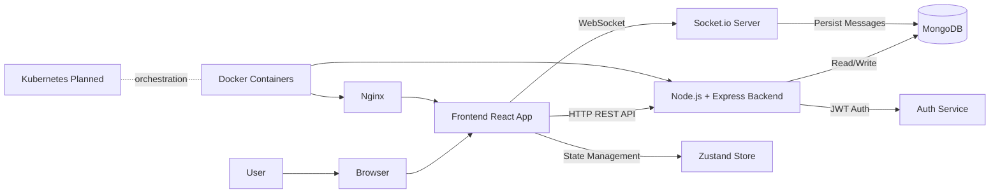

# 🚀 DevOps Engineer Portfolio

A modern, responsive portfolio website showcasing DevOps engineering skills, projects, and certifications.


## 👋 About

This is the personal portfolio website of **Mohammad Kasim**, an aspiring DevOps Engineer specializing in infrastructure automation, CI/CD pipelines, and cloud-native applications.

## ✨ Features

- **Modern Dark Theme** - Professional dark UI with gradient accents
- **Animated 3D Cube Background** - Interactive cube network animation
- **Responsive Design** - Fully responsive across all devices
- **Smooth Animations** - Fade-in animations and hover effects
- **Interactive Terminal** - Terminal-style hero section showcasing skills
- **Mobile Navigation** - Hamburger menu for mobile devices

## 📂 Sections

| Section | Description |
|---------|-------------|
| **Hero** | Introduction with animated terminal display |
| **About** | Professional background and expertise |
| **Skills** | Technical skills and technologies |
| **Projects** | Portfolio of DevOps projects |
| **Certifications** | Professional certifications |
| **Blogs** | Technical blog posts |
| **Contact** | Contact form and social links |

## 🛠️ Technologies & Skills Showcased

### DevOps & Cloud
- Docker & Kubernetes
- AWS Cloud Services
- Terraform (Infrastructure as Code)
- Jenkins CI/CD
- Ansible Automation
- Helm Charts

### Monitoring & Observability
- Prometheus
- Grafana
- Application Monitoring

### Development & Version Control
- Git & GitHub
- Bash Scripting
- Linux Administration

## 🚀 Getting Started

### Prerequisites
- A modern web browser
- (Optional) A local web server for development

### Installation

1. **Clone the repository**
   ```bash
   git clone https://github.com/Kasim2908/Kasim-explore.git
   cd Kasim-explore
   ```

2. **Open in browser**
   - Simply open `index.html` in your web browser
   - Or use a local server:
     ```bash
     # Using Python
     python -m http.server 8000
     
     # Using Node.js
     npx serve
     ```

3. **View the portfolio**
   - Navigate to `http://localhost:8000` (if using a local server)

## 📁 Project Structure

```
├── index.html      # Main HTML file with portfolio content
├── style.css       # Custom CSS styles and animations
├── script.js       # JavaScript for interactivity
└── README.md       # Project documentation
```

## 🎨 Customization

### Colors
The color scheme can be customized in both `style.css` and the Tailwind config in `index.html`:

```css
:root {
    --primary: #3b82f6;    /* Blue */
    --secondary: #8b5cf6;  /* Purple */
    --accent: #10b981;     /* Green */
    --dark: #0a0a0f;
    --darker: #050507;
}
```

### Content
Update the content directly in `index.html`:
- Personal information in the Hero section
- Skills and technologies in the Skills section
- Project details in the Projects section
- Contact information in the Contact section

## 📱 Responsive Breakpoints

- **Mobile**: < 768px
- **Tablet**: 768px - 1024px
- **Desktop**: > 1024px

## 🔧 Built With

- **HTML5** - Semantic markup
- **CSS3** - Custom animations and styling
- **JavaScript** - Interactive elements
- **Tailwind CSS** - Utility-first CSS framework (via CDN)
- **Font Awesome** - Icon library
- **Google Fonts** - Inter font family

## 📄 License

This project is open source and available under the [MIT License](LICENSE).

## � Deployment

This portfolio is automatically deployed to GitHub Pages using GitHub Actions.

### How it works
1. Push changes to the `main` branch
2. GitHub Actions workflow automatically triggers
3. Site is deployed to GitHub Pages

**Live URL:** [https://kasim2908.github.io/Kasim-explore/](https://kasim2908.github.io/Kasim-explore/)

## 📬 Contact

**Mohammad Kasim** - DevOps Engineer

- 🌐 Portfolio: [View Live](https://kasim2908.github.io/Kasim-explore/)
- 💼 LinkedIn: [Connect](https://www.linkedin.com/in/mohammad-kasim-391325372/)
- 🐙 GitHub: [@Kasim2908](https://github.com/Kasim2908)

---

<p align="center">
  Made by Mohammad Kasim
</p>

---

## Real-Time Chat Application

### Introduction

This project provides a scalable and secure real-time chat experience with modern frontend and backend tooling. It is designed for maintainability, instant communication, and clean architecture.

### Detailed Workflow

1. Users interact with the React frontend in the browser for login, messaging, and profile actions.
2. The frontend uses HTTP APIs for authentication and data operations, and WebSockets for real-time updates.
3. The Node.js and Express backend handles API requests, validates JWT tokens, and manages business logic.
4. Socket.io enables bidirectional communication for instant message delivery, typing indicators, and online presence.
5. MongoDB stores persistent data such as user profiles, messages, and related chat metadata.

### Flow Architecture



### Features

- Real-time Messaging: Send and receive messages instantly using Socket.io.
- User Authentication and Authorization: Secure user access with JWT.
- Scalable and Secure Architecture: Built for higher traffic and growth.
- Modern UI Design: React with TailwindCSS and DaisyUI.
- Profile Management: Upload and update profile pictures.
- Online Status: Real-time online and offline indicators.

### Tech Stack

- Backend: Node.js, Express, MongoDB, Socket.io
- Frontend: React, TailwindCSS
- Containerization: Docker
- Orchestration: Kubernetes (planned)
- Web Server: Nginx
- State Management: Zustand
- Authentication: JWT
- Styling Components: DaisyUI

### Prerequisites

- Node.js (v14 or higher)
- Docker
- Git
